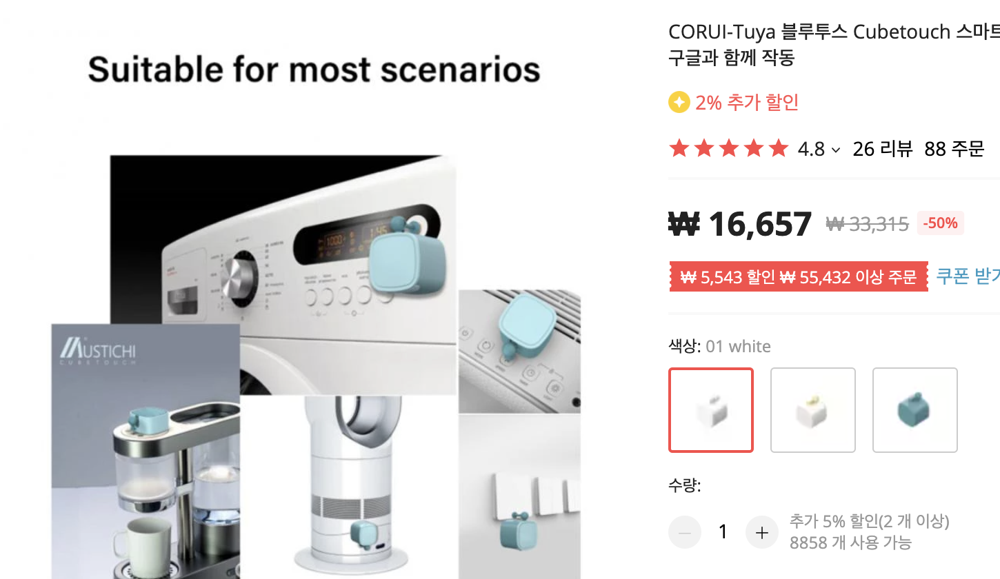
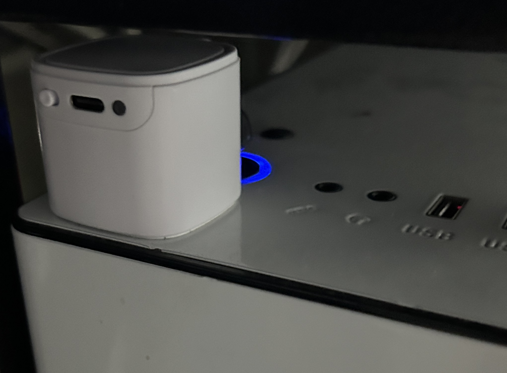
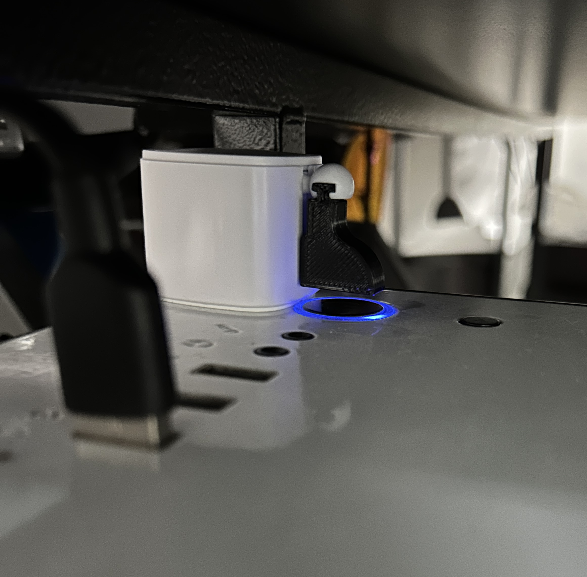
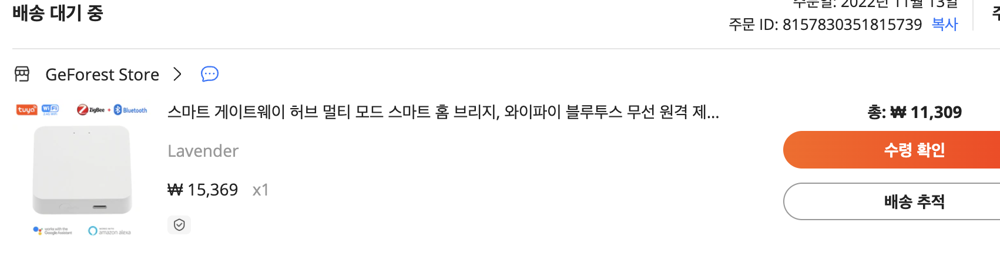

얼마전 알리에서 스마트 스위치를 샀다.

며칠만에 다시 가보니 그 사이 2천원이 더 싸졌다. 환율 때문인가.
열받는다.. (달러 환율 손실도 2천만원을 찍었다 ㅅㅂ)

3D프린터 쿨러가 너무 시끄러워 원격 오프 시키려 주문했는데
가장 싼 걸(터치큐브, CubeTouch) 주문했더니
모터의 토크가 약해 스위치를 오프시킬 힘이 부족했다.

처음에는 버튼을 누르는 파츠가 맞지 않는 줄 알고
프린터로 여러가지 모양을 뽑아 연결해 봤는데 그게 아니라 그냥 모터 힘이 부족한 것이었다.

하긴 직접 off시키려 해도 손가락에 힘을 꽤 줘야해서 힘들것 같긴 했었다. 그래서 안되면 버릴려고 싼거 산거다.
이걸 정말 버려야 하나 고민하다가 데스크탑을 on/off 시키면 좋겠다는 생각이 들었다.
바로 본체에 붙여봤다.

잘된다. 
3d프린터에 쓰려고 연결한 파츠도 딱 맞게 작동했다.
다만 블루투스 연결이라 외부에서는 on/off 시킬수 없었다.

그래서 추가로 주문한 스마트 허브. 알리에서 가격이 무려 11,309원!
믿기 힘들 정도로 싼 가격에 몇번을 확인해보았지만 맞는 것 같아 일단 주문했다.

3D프린터 on/off는 쿠팡에서 스마트 플러그를 구입해 사용할 생각이다. 
최근 꽤 많은 것들을 바꾸고 있다..