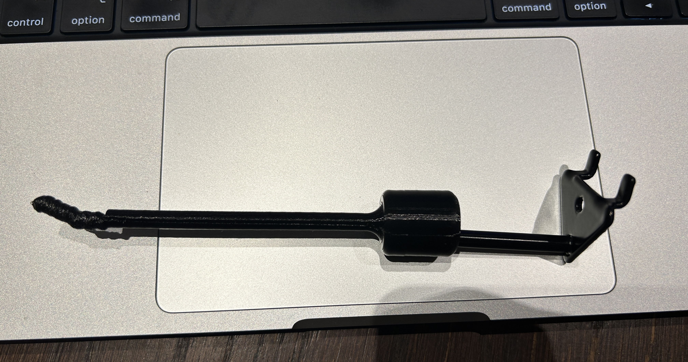

페그보드는 쿠팡에서 샀다. 가격과 사이즈 모두 마음에 들었다. 하지만 알리에서 따로 후크를 산 후에야 이 페그보드의 중심간 구멍 간격이 표준과 다르다는 것을 깨달았다.  thingiverse에서 다운 받은 모든 페그보드 후크들도 맞지 않았다. 간격이 너무 좁았다.

그리고 전용 후크들은 매우 비쌌다. 14mm 후크의 경우 5개에 15,000원이었다. 동의하기 어려운 가격이었다. 페그보드를 싸게 팔고 후크를 비싸게 파는 전략인거 같았다. 
쪼잔해진 기분이긴 하지만 어쨌든 좀 더 알아보니 auvil에서 나온 후크들이 다행히 호환되었다. 가격은 1개에 1,000원꼴. 1/3의 가격이다.

다 좋은데 문제는 14mm처럼 긴 후크가 없었다. 긴 후크는 테이프들을 담거나 필라멘트들을 걸어두는데 용이하다. 
그래서 직접 만들었다.

(이상한) 문제는 후크 끝 살짝 기울어지는 부분의 인쇄가 가끔 엉망이 된다는 것이다. 기울기 때문은 아니것 같은데 - 30도 밖에 안되는 이 정도 기울기에는 오버행 문제가 발생하지 않는다 - 문제가 랜덤하게 발생하고 있다.

이유를.. 모르겠지만 여러개 뽑다보면 문제 없는게 나오기도 하고; 
치명적이지도 않아서 잘 쓰고 있다. 필라멘트는 몰라도 테이프정도는 걸어두기에 충분한 강도를 가지고 있다.